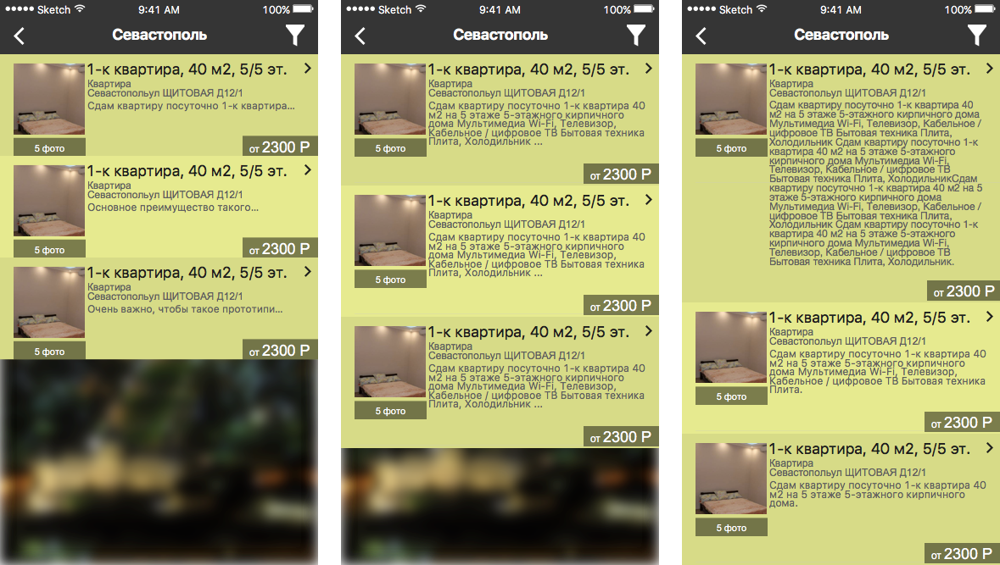

# ios_design_notes

Данная заметка создана iOS разработчиком, чтобы описать частые ошибки, которые встречаются в дизайне iOS приложений.

- [Введение](#Введение)
- [Ожидания разработчика](#Ожидания-разработчика)
  - [Иконки](#Иконки)
  - [Размеры холста для отрисовки экранов](#Размеры-холста-для-отрисовки-экранов)
  - [Отрисовка элементов](#Отрисовка-элементов)
    - [Размеры элементов](#Размеры-элементов)
    - [Содержимое элементов](#Содержимое-элементов)
    - [Придумывание своих действий](#Придумывание-своих-действий)
    - [Цвета](#Цвета)
    - [Шрифты](#Шрифты)

## Введение
Если вы еще не знакомы с принципами построения интерфейса для iOS рекомендую ознакомиться: https://developer.apple.com/ios/human-interface-guidelines/

Так же рекомендую ознакомиться с краткой версией, чтобы создавать действительно удивительные приложения: https://designcode.io/iosdesign или http://ivomynttinen.com/blog/ios-design-guidelines

## Ожидания разработчика
### Иконки

<table width="100%" >
  <tbody>
    <tr>
      <th width="33%">iPhone</td>
      <th width="33%">iPad</td>
      <th width="33%">Apple Watch</td>
    </tr>
    <tr>
      <td width="33%" align="center"> 58x58 80x80 87x87 120x120 180x180 </td>
      <td width="33%" align="center"> 29x29 40x40 58x58 76x76 80x80 152x152 167x167 </td>
      <td width="33%" align="center"> 48x48 55x55 58x58 80x80 87x87 172x172 196x196 </td>
    </tr>
  </tbody>
</table>

Можно использовать плагин для скетча (https://github.com/tadija/AEIconizer) или установить Xcode из AppStore и создать asset в нем, который потом скинуть разработчикам

Иконка для AppStore 1024x1024. Подробнее: http://bit.ly/appstoreicon

### Размеры холста для отрисовки экранов

Для отрисовки дизайна в векторных редакторах используйте масштаб **x1**

Для отрисовки, например, в Photoshop используйте выделенный размер
<table width="100%" >
  <tr>
    <th width="25%">Устройство</td>
    <th width="25%">x1</td>
    <th width="25%">x2</td>
    <th width="25%">x3</td>
  </tr>
  <tr>
    <td width="25%" align="center">iPhone 4</td>
    <td width="25%" align="center">320x480</td>
    <td width="25%" align="center"><strong>640x960</strong></td>
    <td width="25%" align="center">960x1440</td>
  </tr>
  <tr>
    <td width="25%" align="center">iPhone 5</td>
    <td width="25%" align="center">320x568</td>
    <td width="25%" align="center"><strong>640x1136</strong></td>
    <td width="25%" align="center">960x1704</td>
  </tr>
  <tr>
    <td width="25%" align="center">iPhone 6</td>
    <td width="25%" align="center">375x667</td>
    <td width="25%" align="center"><strong>750x1334</strong></td>
    <td width="25%" align="center">1125x2001</td>
  </tr>
  <tr>
    <td width="25%" align="center">iPhone 6+</td>
    <td width="25%" align="center">414x736</td>
    <td width="25%" align="center">828x1472</td>
    <td width="25%" align="center"><strong>1242x2208</strong></td>
  </tr>
  <tr>
    <td width="25%" align="center">iPad</td>
    <td width="25%" align="center">768x1024</td>
    <td width="25%" align="center"><strong>1536x2048</strong></td>
    <td width="25%" align="center">2304x3072</td>
  </tr>
  <tr>
    <td width="25%" align="center">iPad Pro</td>
    <td width="25%" align="center">1024x1366</td>
    <td width="25%" align="center"><strong>2048x2732</strong></td>
    <td width="25%" align="center"></td>
  </tr>
</table>

В качестве базовых лучше использовать размеры под iPhone 6 и iPhone 5. Т.е. Ориентируемся на размеры **750x1334** и **640x1136**.

Шаблоны для Sketch и Photoshop можно взять здесь: http://www.teehanlax.com/tools/ или https://drive.google.com/open?id=0B8mlqMjdzhKSMG1SVTc1WlB2Vm8

### Отрисовка элементов
**Photoshop: SMART OBJECT – ПЛОХО!**

**Разбивайте все по папкам, но не компонуйте в smart object**

#### Размеры элементов
Для любого устройства размеры элементов должны нацело делиться на выбранный масштаб интерфейса.

Пример: дизайн рисуется для iPhone 5 (x2, 640x1136), то в дизайне у нас должны отсутствовать элементы размеров 21х21, 17х17 и подобные, поскольку они не делятся нацело на 2. Тоже самое применяется и к отступам, и к расстояниям между элементами.

#### Содержимое элементов
Если на экране присутствуют поля ввода, то должен быть предусмотрен вариант с открытой на экране клавиатурой. Если на фоне есть логотип, то его можно посмотреть, скрыть, уменьшить или сдвинуть. На iPhone 4 логотип может не умещаться с открытой клавиатурой, а на iPhone 5, 6 и 6+ ничего с логотипом делать не надо. Такие варианты желательно предусматривать.

Если экран списка содержит нестатичную информацию, то необходимо предусмотреть вариант, что текст не будет умещаться на одной строке, надо решить будем его обрезать, переносить, ограничивать перенос только 2 строками или ячейка будет расширяться, чтобы уместить весь текст.

Пример:
  1. Обрезаем строку
  2. Отображаем 5 строк
  3. Ячейка расширяется в зависимости от текста

#### Придумывание своих действий
Не надо придумывать свои какие-то элементы для стандартных действий (иначе уметь это обосновать), к которым пользователи привыкли. Не надо на ячейки добавлять кнопки удаления, для этого есть стандартный свайп влево, для дополнительных действий можно добавить кнопки к свайпу влево или вправо. Не надо использовать стандартные элементы для нестандартных решений.

Например, не надо использовать элемент UISwitch как кнопку удаления, это своего рода Checkbox на iOS.

#### Цвета
Желательно сразу определяться с цветовой палитрой, чтобы не получилось так, что в приложении используется 15 градаций серого цвета. Для удобства предлагаю создавать слой или отдельный файл с палитрой цветов, чтобы было видно какие цвета используются в приложении и в каком количестве. Это так же упростит разработчику перенос всех цветов в код приложения.

Дополнительная информация: https://developer.apple.com/ios/human-interface-guidelines/visual-design/color/

#### Шрифты
Список стандартных шрифтов iOS можно увидеть по ссылке: http://iosfonts.com/ (если недоступно https://github.com/mcritz/iosfonts).

Если вам не хватает представленных шрифтов, то желательно скидывать их вместе с дизайном. Так же как и с элементами, если дизайн нарисован в масштабе N, то размер шрифта должен нацело делиться на N. По аналогии с цветами не надо использовать множество шрифтов и их размеров.

Дополнительная информация: https://developer.apple.com/ios/human-interface-guidelines/visual-design/typography/
